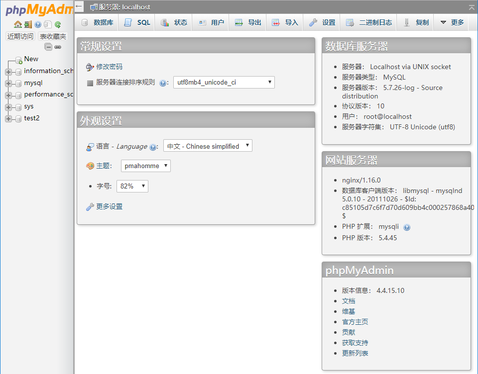

# 闲余翻身 后台部署文档
项目的后端实现
- python3.7 Flask
- MySQL

## 一、部署架构图


## 二、部署流程

### 1. 服务器后台环境配置

#### 1.1 服务器系统环境

- 阿里云 CentOS 7.3

#### 1.2 宝塔面板 安装

- [官方安装文档](http://docs.bt.cn/443922)

安装之后根据安装提示的url以及用户名密码成功登陆宝塔面板就说明安装成功

- 安装成功之后开放端口5000，用于数据的传输

#### 1.3 LNMP环境的安装

- [官方文档](http://docs.bt.cn/424212)
- MySQL版本选择5.7

```mysql
刚装完的mysql默认实没有密码的
mysql -u root -p
即可成功登陆，提示welcome to the mysql monitor! 的字样即表示登陆成功
退出之后输入
mysqladmin -u root -p password
根据提示进行重置
```

#### 1.4 SMTP邮件推送服务器

- 使用的是阿里云的邮件推送功能

[阿里云-如何在DNS服务器上配置域名](<https://help.aliyun.com/knowledge_detail/39397.html>)

- 创建发信地址的发送地址以及密钥

### 2. 服务器程序配置运行

#### 2.1 拉取后台源代码

```
git clone https://github.com/sysu-team1/BackEnd.git
```

#### 2.2 创建secret.py文件

- 该文件放在与app.py同个目录下

内容大致如下：

```python
# 发件人地址，通过控制台创建的发件人地址
USERNAME = '发件人地址'
# 发件人密码，通过控制台创建的发件人密码
PASSWORD = '发件人密码'
# 自定义的回复地址
REPLYTO = ''
```

#### 2.3 修改app.py文件

main函数修改为如下

```python
if __name__ == "__main__":
	uploaded_photos = UploadSet('photos')
	configure_uploads(app, uploaded_photos)
	enter_event_and_run_scheduler()
	app.run(debug=True, host='0.0.0.0', port=5000, threaded = True)
```

#### 2.4 数据库的配置

```mysql
mysql的root账号密码是mysql
创建数据库test2
mysql -u root -p mysql
create database money;
exit;
```

#### 2.5 一键运行

```python
python -m pip install -r requirements.txt
python app.py
```

看到下面的信息表示运行成功


#### 2.6 预装载数据

TODO需要写一个路由


## 三、常见问题解决方法

### 1. 查看数据库内部状态使用

- 通过面板上的phpMyAdmin可以进行查看




### 2、需要重建数据可

- 跟上面一样，支持手动删除与创建

### 3、数据库中无数据

- 请再次尝试使用api导入初始数据

### 4、Python版本不正确

- 从宝塔面板左侧栏的软件商店中查询安装**Python项目管理器**，通过项目管理器的设置安装Python3.7

```python
# 查看已经安装的python版本
pyenv versions
# 切换python版本
pyenv global 3.7.2
```

### 5、一切正常但是就是连接不上

- 检查宝塔面板中以及阿里云控制台是否有设置5000端口自定义开放

### 其他不确定错误

1. 请检查系统环境配置是否与本仓库部署环境一致

- python3.7.2
- requirements.txt

2. 
3. Email 联系仓库维护者 